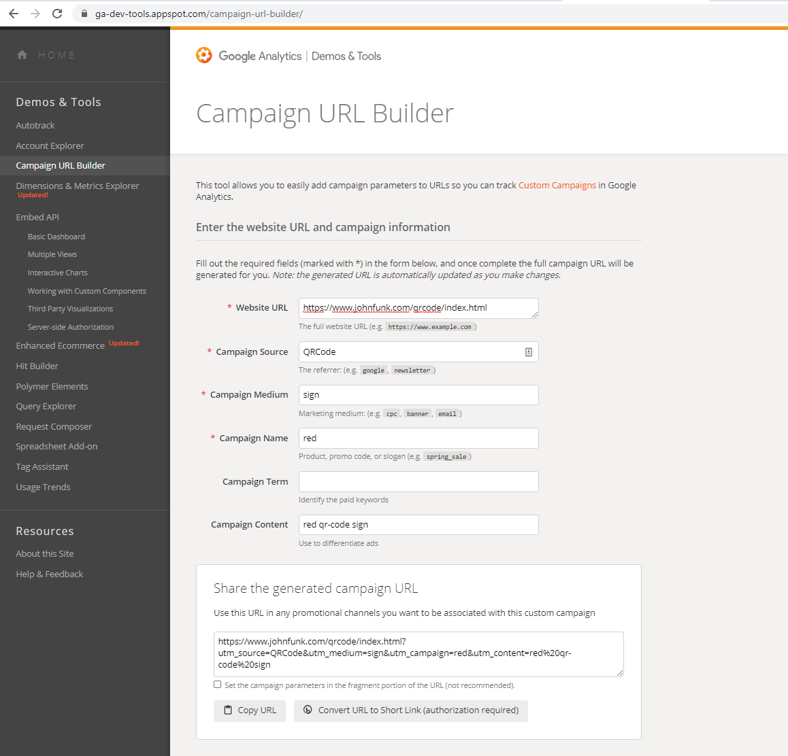

# QRCodeSignDemo
Simple Demo Showing the Use of QR Codes and Google Analytics Campaigns


For this scenario we want to setup a red sign and a green sign with QR codes on them.  We will use Google analytics campaigns to see which sign gets the most people scanning the QR code.

We'll use a very simple test page that is instrumented with Google Analytics as the destination for this demo
Here is the code for this webpage:
```html
<!doctype html>
<html>
<head>
   <meta charset="utf-8">
     <title>Thanks for visiting!</title>
   <meta name="KeyWords" content="John Funk QR Code Campaign Tutorial">
</head>

<!------ Google Analytics begin ----->
<script type="text/javascript">
var gaJsHost = (("https:" == document.location.protocol) ? "https://ssl." : "http://www.");
document.write(unescape("%3Cscript src='" + gaJsHost + "google-analytics.com/ga.js' type='text/javascript'%3E%3C/script%3E"));
</script>
<script type="text/javascript">
var pageTracker = _gat._getTracker("UA-3346206-1");
pageTracker._initData();
pageTracker._trackPageview();
</script>
<!------ Google Analytics end ----->    
    
<body>
    Thanks for visiting!
</body>
</html>

```

## Step 1:  Generate a URL for the red campaign


## Step 2: Generate a QRCode for the red sign

I saved the .png and the .svg as RedQRCode.png and RedQRCode.svg

## Step 3: Generate a URL for the green campaign


## Step 4: Generate a QRCode for the green sign

I saved the .png and the .svg as GreenQRCode.png and GreenQRCode.svg

## Step 5: After a little colorizing for demo purposes here are the two signs we can place:


## Step 6: The Google Analytics real-time dashboard shows the usage. 


## Step 7: Alternativly the Googal Analytics campaign dashboard will show historical results.

